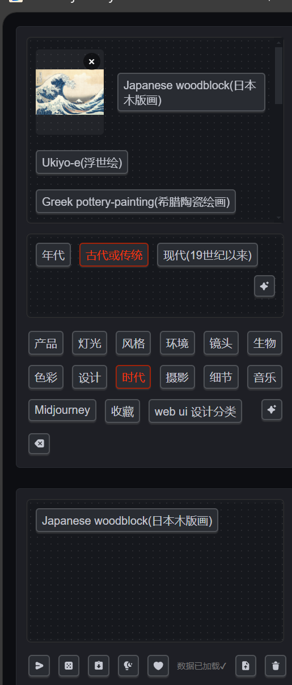

# 做出的修改：
 1.添加了图片显示的功能
 
 可以直接将图片拖入对应二级分类中，之后可点击对应的名称进行显示

# 有哪些功能

- 支持**AI 快速生成**领域专业术语
- 清晰的**可视化**的提示词编辑
- 支持**备注翻译**或者提示
- 支持编辑现有提示词并**获取翻译**
- **随机抽取**提示词以获取灵感
- **完全自定义**编辑用户提示词列表

# 怎么安装
直接git clone到本地即可
或者在
# License

[LICENSE](./LICENSE)
